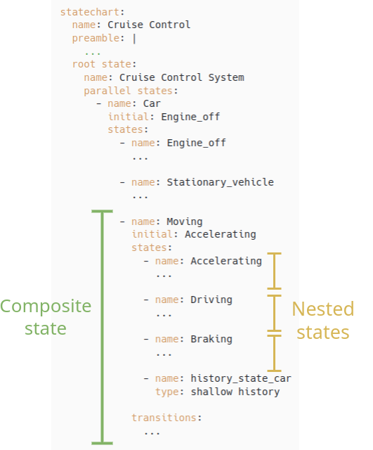

# SISMIC tutorial by example

The purpose of this tutorial is to explain how to implement and test a statechart using [the SISMIC library](https://github.com/AlexandreDecan/sismic), by a means of a complete example created from scratch. We follow the methodology described in the scientific article [A method for testing and validating executable statechart models](https://doi.org/10.1007/s10270-018-0676-3).

# Context and methodology

The example used in this tutorial is a statechart to model and simulate the Adaptative Cruise Control of a car. To create the statechart with SISMIC we will go through the following steps :

1. Design phase
   1. Statechart design
      1. Defining the statechart
      2. Integrating code into the statechart
   2. Defining scenarios
   3. Defining properties
   4. Enriching the statechart with contracts
   5. Defining unit tests 
2. Interfacing to External Components
   1. Initializing the statechart
   2. GUI and events
   3. Using a shared object
3. Second iteration

According to the methodology described in the article, one should first analyse the problem by making a user story, a UI mock-up and a component diagram, but this will not be covered in the current tutorial. 

Here is the UI mock-up of the GUI that will interact with the statechart. Different buttons can send events to the statechart (acceleration pedal, brake pedal, engine start button, ...) and some data from the statechart can be viewed on the dashboard (the speed, the memorized speed, indicator of Cruise Control switched on).

<p align="center">
   
</p>

The methodology also suggests to work in an iterative way. We will do so by first carrying out all the aforementioned steps for implementing a basic Cruise Control and then iterating over these steps again to add extend the model to an Adaptative Cruise Control. All the files of this tutorial can be found on [this GitHub repository](https://github.com/University-of-Mons/sismic-tutorial).

# Design phase

## Design statechart

We suggest that you start designing your statechart on a piece of paper or some software application before actually implementing it for the first time in SISMIC. (In our case, we used the statechart modeling capabilities of the Itemis Create tool for creating the statechart model.)

<p align="center"> 
   
</p>

The statechart is composed of 2 parallel regions. The first region represents the behaviour of a simplified car and the second region represents the Cruise Control behaviour. As described before, the statechart will interact with a GUI. Then, most of the events in the statechart are triggered by buttons (acceleration pedal, brake pedal, engine start button, ...).

#### Car

The statechart in the Car region starts with its engine off. If we press the start_stop button, the vehicle will be stationary but with its engine on. Then, by accelerating, the car will start moving and can alter between 3 substates :
- Accelerating : when the driver presses the acceleration pedal or the Cruise Control accelerates
- Braking : when the driver presses the brake pedal
- Driving : when there is no acceleration or braking happening

In each of these cases, whenever a tick is triggered from an external clock, the model will evaluate the speed of the car following its actual state :

- If the car is accelerating, the speed will increase in function of the provided acceleration rate
- If the car is driving, the speed will decrease slowly (to simulate the friction of the car with the road)
   If the car is braking, the speed will be decrease much faster

A similar process as described above can be used to go back to the engine off state.

#### Cruise Control

The statechart in the Cruise Control (CC) region is considerably more complex. Only the main operations are described below to keep things short and clear.

When the car engine is turned on, the CC transitions from Unavailable to Off. Then, when the on_off button is pressed, the CC transitions to On and becomes ready to take control of the car speed. But before that, it has to know at which speed it needs to remain. To do so, the driver has to accelerate to a certain speed and press the SET button. This will have for effect to activate the CC at the speed the car was driving.

When the CC is activated, either it is not accelerating, or it is accelerating if the current speed is still below the target speed (mem_speed). At any moment, the driver can decide to accelerate the car by itself. This will pause the CC and resume it when releasing the acceleration pedal. The driver can also decide to brake, which will deactivate the CC. The target speed can be changed through the +/-/SET/RES buttons.


### Defining the statechart in SISMIC

Once the statechart is designed, we can now implement it in SISMIC. [This page of the SISMIC documentation](https://sismic.readthedocs.io/en/latest/format.html) explains the syntax to follow for the different states and transitions. Here, we will explain, in a top-down approach, how to assemble these states to define a complex statechart.

#### Parallel states

The initial configuration of the statechart is modeled in SISMIC as two parallel state representing the Car and Cruise Control parts. The code then starts with the following syntax. 

<p align="center">
   
   <br>
   
</p>


#### Composite states

If we look deeper in the statechart, each parallel state contains several substates, of which some or basic states and some are composite states. For example, the parallel state Car contains two basic states Engine_off and Stationary_Vehicle, and one composite substate Moving. This composite state is itself composed of 3 nested substates, of which the initial one is Accelerating. This is declared as follows.


<p align="center">
   
   
</p>

#### States & transitions

Now that the composite states has been defined, we can move on to the basic states. These are defined by their names, their (optional) external transitions and an (optional) on-entry event. Code execution in states will be discussed in the next section. Here is an example of transitions' definition.

<p align="center">
   
   
</p>


### Integrating code into the statechart

To execute code under certain circumstances, a statechart can include code execution in states and  transitions.

Some variables are also used inside the statechart. The main one is `mem_speed` that is the memorized speed for the CC. To interact with this variable, we first need to declare it in the preamble of the statechart and we can then use it in every code section (preamble, on entry, on exit, guard, action).

Here is an example of its definition in the preamble and its usage in the on-entry code of the Off state.

<p align="center">
   
   
</p>

As we see in the yaml file, a preamble can be defined to execute code during the instantiation of the statechart. Here, we use this to define variables as described before. A use case of these variables is the on-entry code of the Off state which sets the memorized speed to 0. It ensures that each time we switch off or on the CC, the memorized speed will not be kept at its previous value.

Code can be written in a single line or multiple lines by using `|` and writing at the next line, as done in the preamble. Each code section is written in Python. The reader may notice that some code lines are not implemented the same way it is designed in the graphical statechart, this is because some operations are done on a shared object (car). This will be covered in section 3.1.


## Defining scenarios

Behavior-driven development (BDD) scenarios provide a natural and effective way to test and validate statecharts, as the tests are directly linked to specific behaviors (i.e., events sent).

In SISMIC, which uses Gherkin, we define a feature file where each test case is described in plain language. These test cases consist of a series of actions or conditions, followed by a set of expected outcomes.

A second file contains the concrete implementation of these steps in Python. Here, we can either define custom code or use predefined step implementations.

Here is an example of basic steps:

```gherkin
Feature: Cruise Control

        ...

        Scenario: Accelerate the car
             When the vehicle is stationary
              And I accelerate
             Then I am accelerating
              And the speed is 1

        Scenario: Stop accelerating
             When I am accelerating
              And I stop accelerating
             Then I am driving
```


Because in the Cruise Control statechart needs a shared object (see later why), we need to instantiate it during the creation of the statechart. Because SISMIC initiate it by itself, and hence, without our shared object, we had to do a little trick to allow this. We created a "I initialize the context" step, that is executed before any other steps. Here is its definition and usage:

```py
@when('I initialize the context')
def initialize(context):
    statechart = import_from_yaml(filepath='statechart.yaml')
    car = Car()
    inter = Interpreter(statechart, initial_context={'car':car})
    context.interpreter = inter
```


```gherkin

Feature: Cruise Control

        Scenario: The speed is 0 when the engine is off
             When I initialize the context
              And the engine is off
             Then the speed is 0

        Scenario: Turn on the car
             When I initialize the context
              And the engine is off
              And I press the engine_start_stop button
             Then the vehicle is stationary
```

Some other advanced steps has been defined, for example, the possibility to accelerate to a target speed: 

```py
@when('I accelerate to {value} km/h')
def accelerate_to(context, value):
    context.execute_steps('when I send event accelerate with accel=100')
    
    while context.interpreter.context["car"].get_real_speed() <= int(value):
        context.execute_steps('when I send event tick')

    context.execute_steps('when I send event stop_accelerate')
```

Most of our features are based on previous features to avoid using too many redundant steps. To allow this, we use the "I reproduce" predefined step. Here is an example:

```gherkin
Feature: Cruise Control

        Scenario: Turn on the car
             When I initialize the context
              And the engine is off
              And I press the engine_start_stop button
             Then the vehicle is stationary

        Scenario: Accelerate the car
             When the vehicle is stationary
              And I accelerate
             Then I am accelerating
              And the speed is 1
```
```py
map_action('the engine is off', 'I do nothing')
map_action('I press the engine_start_stop button', 'I send event engine_start_stop_button_pressed')

map_assertion('the vehicle is stationary', 'state Stationary_vehicle is active')
map_action('the vehicle is stationary', 'I reproduce "Turn on the car"')

@then('the speed is {value}')
def speed(context, value):
    assert context.interpreter.context["car"].get_speed() == int(value)
```

## Defining properties

Property statechart are used in sismic to monitor some properties. These properties define a behaviour that is supposed to be respected and a behaviour that is not supposed to happen. If a bad behaviour is detected at run-time (a final state), an error is thrown.

These statecharts are defined in a YAML file, just as described before. Here is an example of property statechart and its usage.

<p align="center">
   
</p>

```yaml
statechart:
  name: speed_not_null
  root state:
      name: speed_not_null
      initial: Desactivated
      states:
        - name: Desactivated
          transitions:
            - target: Activated 
              event: state entered
              guard: event.state == 'Activated'
        
        - name: Activated
          transitions:
            - target: Desactivated
              event: state entered
              guard: event.state == 'On' or event.state == 'Off' or event.state == 'Unavailable'

            - target: Fail 
              event: state entered
              guard: event.state == 'Stationary_vehicle'
          
        - name: Fail
          type : final
```

This property statechart define that the Cruise Control can not be activated if the speed is 0 (stationary vehicle). To achieve this, the states Activated and Desactivated alternates and if the vehicle is stationary while the CC is Activated, then we reach the final state and throw an error.

To include property statecharts in the code, we do the following:

```py
statechart = import_from_yaml(filepath='statechart.yaml')
car = Car()
inter = Interpreter(statechart, initial_context={'car':car})
property_statechart = import_from_yaml(filepath="property.yaml")
inter.bind_property_statechart(property_statechart)
```

We can bind as many property statecharts as needed to the main statechart.

Some properties need a little trick to be expressed. For example, to check that braking while the CC is Activated causes the CC to be Deactivated, we need to add an intermediate state in the property statechart. This state should be temporary and last no more than a clock tick. The reason is that Sismic cannot directly check the consequence of an event within a property statechart. Without this intermediate state, the condition might end up being false at some point, leading to a verification error. Here is the visual statechart and code to illustrate this workaround.

<p align="center">
   
</p>

```yaml
statechart:
  name: desactivated_when_braking
  root state:
      name: desactivated_when_braking
      initial: Desactivated
      states:
        - name: Desactivated
          transitions:
            - target: Activated 
              event: state entered
              guard: event.state == 'Activated'
        
        - name: Activated
          transitions:
            - target: Desactivated
              event: state entered
              guard: event.state == 'On' or event.state == 'Off' or event.state == 'Unavailable'

            - target: Braking
              event: event consumed
              guard: event.event.name == 'brake'

        - name: Braking
          transitions:
            - target: Fail
              event: tick

            - target: Desactivated
              event: state entered
              guard: event.state == 'On' or event.state == 'Off' or event.state == 'Unavailable'
          
        - name: Fail
          type : final
```


## Enriching the statechart with contracts

Contracts are conditions to be verified during transitions, state entry, state exit or any macro step. These conditions can be set to be verified before a transition is taken or before entering a state (precondition), after a transition is taken or after exiting a state (postcondition) or both (invariants). If a contract is broken during a transition, this will raise an error. This is another way to ensure that the statechart is working properly at run-time.

Contracts are integrated in the statechart YAML file, either in a state definition, either in a transition definition. Here is an example of contract in state:

```yaml
statechart:
  name: Cruise Control
    ...
  root state:
    name: Cruise Control System
    contract:
      - always: car.get_speed() >= 0
      - always: not(active('Braking') and active('Activated'))
```

The contract then applies for the root state. This one is constituted of 2 invariants (defined with "always" keyword), meaning that this conditions will be verified at **each** event sent to the statechart (macro step). The conditions are defined in Python code, as in other code segments. Here, they ensure that the speed of the car is always positive or null, and that the statechart can never be in a situation where the car is braking while the cruise control is activated.

Here is another example of contract usage, in transition:

```yaml
statechart:
  name: Cruise Control
    ...
  root state:
    name: Cruise Control System
      ...
      
    parallel states:
      - name: Car
        ...

      - name: Cruise Control
        ...
        states:
          ...
          - name: On 
            transitions:
             ...
              - target: Activated
                event: set_button_pressed
                guard: car.get_speed() < max_mem_speed and car.get_speed() > min_mem_speed and not(active('Braking'))
                action: mem_speed = car.get_speed()
                contract:
                  - after: mem_speed == car.get_speed()

          - name: Activated
            ...
            states:
              - name: CC_driving
                transitions:
                  ...
                  - target: CC_driving
                    event: set_button_pressed
                    guard: mem_speed < car.get_speed() and car.get_speed() < max_mem_speed
                    action: mem_speed = car.get_speed()
                    contract:
                      - after: mem_speed == car.get_speed()
```

In this example, a postcondition contract (using "after" keyword) is used on a transition to ensure that the mem_speed is equal to the speed after we pressed the set button.


## Defining unit tests

Finally, the last way to test and validate your statechart is by doing unit testing, as it is done with conventional code. It can be done using any testing library, but `unittest` will be used here. 

Testing the statechart can be done by using the interpreter object provided by sismic, queuing events, executing them and then asserting the expected results.

Here is an example of some unit testing:

```py
import unittest
class CCTests(unittest.TestCase):
    def setUp(self):
        statechart = import_from_yaml(filepath="statechart.yaml")
        self.car = Car()
        self.cc = Interpreter(statechart, initial_context={'car':self.car})
        self.cc.execute_once()

    def test_braking_when_activated(self):
        self.cc.queue("engine_start_stop_button_pressed")
        self.cc.queue("accelerate", accel=100)
        self.cc.queue("tick","tick","tick","tick","on_off_button_pressed","set_button_pressed","stop_accelerate","tick","tick","tick")
        self.cc.execute()
        self.cc.queue("brake")
        self.cc.execute_once()
        self.cc.queue("stop_brake")
        self.cc.execute_once()
        self.assertNotIn("Activated", self.cc.configuration)
```

We can also assert that an error is raised if a variable of the statechart is modified:

```py
from sismic.exceptions import ContractError

    def test_break_contract_mem_speed(self):
        self.cc.queue("engine_start_stop_button_pressed")
        self.cc.queue("accelerate", accel=100)
        self.cc.queue("tick","tick","tick","tick","on_off_button_pressed","set_button_pressed","tick","tick","tick")
        self.cc.execute()
        with self.assertRaises(ContractError):
            self.cc.context["mem_speed"] = 161
            self.cc.execute_once()

    def test_break_contract_stationary_when_activated(self):
        self.cc.queue("engine_start_stop_button_pressed")
        self.cc.queue("accelerate", accel=100)
        self.cc.queue("tick","tick","tick","tick","on_off_button_pressed","set_button_pressed","tick","tick","tick")
        self.cc.execute()
        with self.assertRaises(ContractError):
            self.car.speed = 0
            self.cc.queue("tick")
            self.cc.execute_once()
```

Tests can then be executed with

```
pytest tests.py
```

# Interfacing to External Components

Now that the statechart has been defined, tested, and validated, it can be integrated into a program that runs a user interface. In this case, we will develop a graphical user interface (GUI) in Python that enables users to interact with the car and its cruise control system, both of which operate based on the implemented statechart.

To achieve this, we will first develop a program that links the statechart to the GUI, and then create a shared object that abstracts the complexity of the car’s operation, enabling the statechart to interact with it through simple calls.

## Integrating the statechart in the code

### Initializing the statechart

The statechart is initialized as follows:

```py
statechart = import_from_yaml(filepath='statechart_with_contracts.yaml')
car = Car()
inter = Interpreter(statechart, initial_context={'car':car})

...

# Instanciate property statecharts
property_dir = os.path.join(os.getcwd(), 'property_statecharts')
if os.path.exists(property_dir):
    for file_path in glob.glob(os.path.join(property_dir, "*property.yaml")):
        property_statechart = import_from_yaml(filepath=file_path)
        inter.bind_property_statechart(property_statechart)

# Initial step
inter.execute_once()
```

The statechart (with contracts !) definition is first imported from the yaml file. Then, the interpreter is initialized with the shared object. Finally, a loop binds all the property statecharts from a directory to the interpreter. To start the statechart in its initial state, we execute the first step.

To manage the acceleration and the deceleration of the car, we need to use a clock to trigger continuous evaluation of the speed. This clock is implemented out of the statechart, that is, in the caller program. The clock is a thread that sends `tick` events to the statechart every 0.1 seconds. Here is its declaration:

```py
def tick_thread():
    global inter
    while True:
        inter.queue("tick")
        inter.execute()
        time.sleep(0.1)

thread = threading.Thread(target=tick_thread, daemon=True)
thread.start() 
```


### GUI and events

The GUI is developed using the pygame library.

Here is a picture of what the GUI looks like so far:

<p align="center">
  
</p>

We have buttons that trigger events and some data visible on the screen. As designed in the statechart, each button will trigger a corresponding event in this one. For example, the engine start/stop button will raise a `engine_start_stop_button_pressed` even.

In the program, each button is associated to a function as follows:

```py
button_actions = {
    "RES": action_res,
    "SET": action_set,
    "-": action_minus,
    "+": action_plus,
    "MODE": action_mode,
    "ON/OFF": action_on_off,
    "DIST": action_dist,
    "ACCEL": action_accel,
    "BRAKE": action_brake,
    "ENGINE": action_engine,
}
```

The function can be defined elsewhere in the code, here is an example of such function:
```py
def action_res(statechart):
    print("Action RES")
    statechart.queue("res_button_pressed")
    statechart.execute_once()

def action_set(statechart):
    print("Action SET")
    statechart.queue("set_button_pressed")
    statechart.execute_once()
```

Finally, these functions are called by events of mouse at certain positions in the main loop of the display: 
```py
# Infinite loop for the display
running = True
while running:
    for event in pygame.event.get():
        if event.type == pygame.QUIT:
            running = False

        # button press
        if event.type == pygame.MOUSEBUTTONDOWN:
            mouse_pos = event.pos
            for button_name, rect in buttons_rects.items():
                if rect.collidepoint(mouse_pos):
                    action = button_actions.get(button_name)
                    if action:
                        action(inter)
                        ...
    ...
```

The function is therefore called with the statechart as a parameter; it queues the event and executes it.

The rest of the implementation are GUI-related and is out of scope of this tutorial. The full code is available on the GitHub.

### Using a shared object

As explained before, using a Python object in the statechart is useful to hide the complexity of some functions. It is also shared with the caller program that can get the variables' value or call some functions.

Here, the Car object is primarily used to manage the car’s speed based on a given acceleration. Here is a part of its implementation:

```py
class Car:
    def __init__(self):
        self.speed = 0
        self.acceleration = 0

    def evaluate_speed(self, mode):
        ... # Is used to calculate the speed for a given acceleration

    def is_stationary(self):
        return self.speed == 0

    def get_speed(self):
        # returns the speed (rounded)
        if self.speed - int(self.speed) >= 0.5:
            return int(self.speed) + 1
        else:
            return int(self.speed)
```

This object is given in the initial context of the interpreter during its creation:
```py
statechart = import_from_yaml(filepath='statechart.yaml')
car = Car()
inter = Interpreter(statechart, initial_context={'car':car})
```

And can then be used from the inside of the statechart, for example in actions or guards: 
```yaml
    (state)
    - name: Moving
      initial: Accelerating
      states:
        - name: Accelerating
          on entry: car.evaluate_speed(1)
          transitions:
            - target: Driving
              event: stop_accelerate
              action: car.set_acceleration(0)
        ...

      transitions:
          ...
        - target: Stationary_vehicle
          guard: car.is_stationary()
```

Here, the Car object is used in the on-entry code of the Accelerating state to update the speed, and in the transition from Accelerating to Driving to set the acceleration to zero when the driver stops accelerating. It also serves as a guard condition for exiting the Moving state when the car becomes stationary.


# Second iteration

Following the methodology described in the scientific article, we can iterate to add new features to our program. Here, we will improve our Cruise Control to an Adaptative Cruise Control, that is, allowing the car to slow down if the security distance with the front car is not respected.

### Statechart design

The statechart was slightly modified to allow the car to brake by itself. It followed the same logic as for the acceleration. Brake is now a parametrized event that the Cruise Control part can raise. A new shared object was introduced, it's a `FrontCar` object which returns the distance to the front car, as a sensor would do.

The statechart is now as the following:

<p>

</p>

### Adapting and adding tests

By adding features, some tests may not work anymore. It was the case here, as we changed the logic behind some components, mainly about the brake that is now parametrized. Hence, only some changes in the steps file is necessary.

As described before, for a new feature, BDD tests, unit tests, property statecharts and contracts should be added to ensure the correctness of the statechart.


